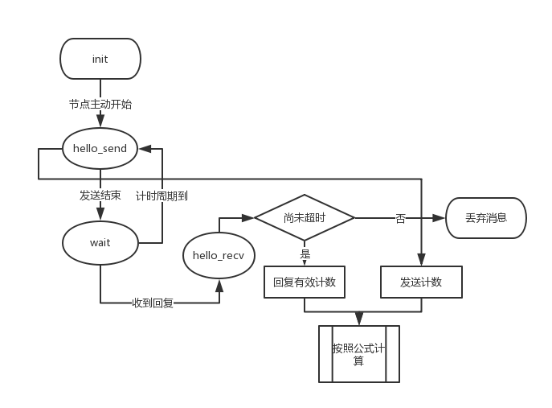
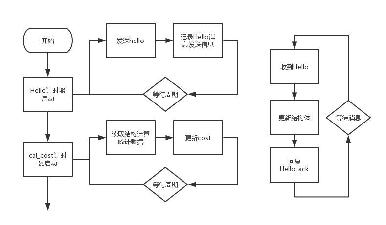
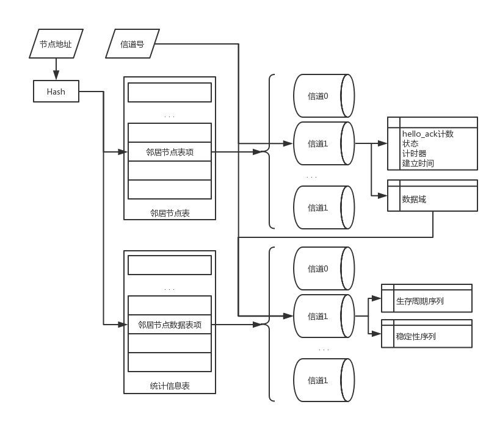
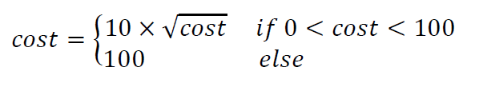
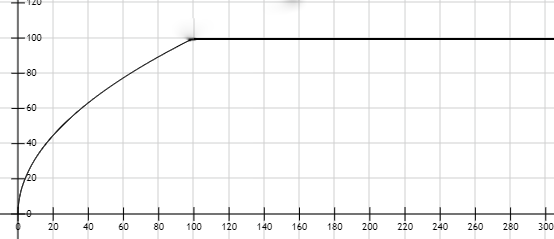
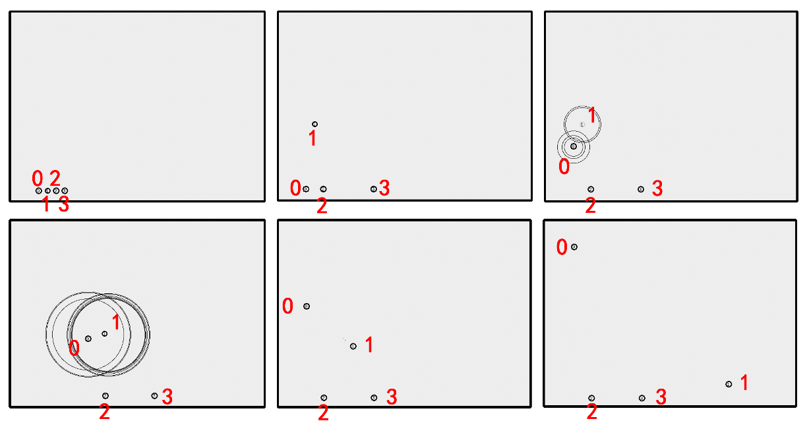
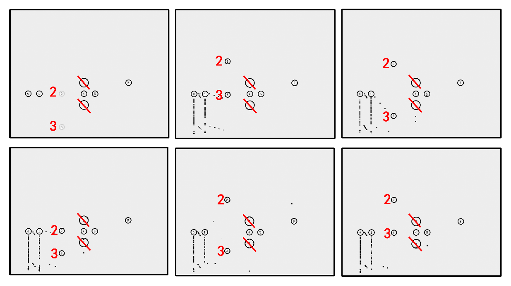

**基于aodv-uu协议的无线认知路由协议优化**
=======================================
**第二部分：链路可用性预测**
==========================

摘要
----
在无线自组织网络的环境下，建立和维护有效的路由是节点通信最基本的问题。本实验立足于Ad-Hoc网络环境基本原理，基于aodv-uu协议，进一步完善了路由建立过程中的基于最小损失的路由发现方法。本实验中自行维护了邻居节点表的结构体，收集并统计期望传递计数；使用ARMA模型进行链路生存周期；再结合节点稳定性预测单元的信息，使用Markov模型给出节点稳定性预测，最终综合给出一跳邻居节点的传输cost，提供给路由发现过程建立起一条基于最小传输损失的路由。

**关键词**： aodv-uu协议，ARMA，Markov，路由建立优化。

Abstract
---------
In the environment of wireless ad hoc networks, establishing and maintaining effective routes is the most basic problem of node communication. Based on the basic principle of Ad-Hoc network environment, this experiment further improves the route discovery method based on minimum loss in route establishment process based on aodv-uu protocol. In this experiment, the structure of the neighbor node table is maintained by itself, and the expected delivery count is collected and counted. The ARMA model is used to perform the link life cycle. Combined with the information of the node stability prediction unit, the Markov model is used to give the node stability prediction. The transmission cost of the one-hop neighbor node is comprehensively provided, and the route discovery process is established to establish a route based on the minimum transmission loss.

**Key words:** Aodv-uu Protocol, ARMA, Markov, Route establishment optimization;
### 引言

自1997年IEEE802.11协议正式发布以来，无线局域网得到了快速发展，但IEEE802.11协议不具有转发功能，组成的网络规模小，传输距离近，需要铺设较多无线接入点，而Ad
Hoc网络则可以弥补这些缺点。

Ad Hoc网络的路由协议作为影响网络性能的一个重要因素，是确保Ad Hoc网络正确运行的关键。由于传统的路由协议己无法满足移动Ad
Hoc网络的要求，因此更适合移动节点特性的路由协议不断的被讨论。AODV路由协议作为Ad
Hoc网络中代表性的按需路由协议，它既能适合军队的无线电台组网，又能扩展无线局域网的应用，具有军民两用的特点，具有广泛的应用前景。

在实现无线自组织网络的过程中，从现有的可用网络中主动地寻找和评价比较不同链路的可用性指标是很重要的一个工作，只有给出提供对于链路可用性的正确预测方法，才有可能建立起一条稳定的、可用时间长的有效路由线路，保障更长时间的消息的成功传递。本实验中，通过对链路的不同方面指标进行考察综合，最终给出了一种基于预测算法的路由可用性判定算法，并实现了链路可用性预测。

测试中，使用ns-2网络环境模拟器，编写tcl脚本设计复杂的网络环境来测试各种链路可用与不可用的变化情况，最终证明了算法都能够正确给出有意义的cost值。

### 实验背景

#### 研究背景

路由协议作为影响网络性能的一个重要因素，是确保Ad
Hoc网络正确运行的关键。路由协议的主要作用是迅速准确地计算到达目的节点的路由，同时通过监控网络拓扑变化来更新和维护路由。Ad
Hoc网络中网络的拓扑结构是动态变化的，路由协议的周期性广播会涉及大量带宽和能量，对系统的性能起到决定性因素，因此，对路由协议的深入了解和分析至关重要。

#### AODV协议

AODV路由协议中文全称为无线自组网按需平面距离矢量路由协议(Adhoc On-Demand
Distance Vector
Routing），该协议是在DSDV协议基础上结合类似DSR中的按需路由机制加以改进后提出的。AODV路由协议由Nokia研究中心的Charles
E.Perkins和加利福尼亚大学Santa Barbara的Elizabeth
M.Belding-Roryer以及Cincinnati大学Samir R.Das等共同开发,已经被IETF
MANET工作组于2003年7月正式公布为自组网路由协议的RFC标准。

AODV路由协议采用了路由发现和路由维护机制，又利用逐跳路由、顺序编号和路由维持阶段的周期性更新，还加入了对组播路由QOS(Quality
of
Service)的支持。AODV路由协议其最显著的特点是为路由表中每个项都使用了目的序列号，因而还可以避免环路的发生，并且很容易编程实现。AODV路由协议是按需式路由协议（又称反应式路由协议）。在源节点需要通信时才在网络中发送路由分组，而不会周期性地交互路由信息以得到所有其它主机的路由；同时它具有距离向量路由协议的一些特点，即各节点路由表只维护本节点到其他节点的路由，而无须掌握全网拓扑结构。

AODV协议工作过程可简单的看作是源节点发起路由请求RREQ，在查找并建立路由后进行通信，并通过使用一个或多个可用连接或者网络层的机制实现连接的保持，在通信完成后断开连接并释放带宽。AODV路由协议在节点移动而导致路由拓扑结果变化时，将会发出路由错误请求来删除错误路由，寻找合适畅通的路由，从而保证了路由信息和网络拓扑结构保持一致。

#### 扩展部分的相关原理/模型

基于态势信息的认知路由重构实现。路由重构主要包含两个部分，一个是路由快速恢复，另一个是路由重发现。路由快速恢复旨在最快速度的恢复路径，尽可能减少需要修改的路由，实现IP通信可达。即当X-\>Y的路由中断时，重新寻找一条由X到Y的路由路径PATH用于代替当前发生连接中断的链路，同时将节点X和Y中原来所有的路由表项迁移到新发现的路由路径PATH。执行完路由快速恢复后，节点X和Y将各自分别通知上游节点链路XY已经发生故障，现在XY间的PATH为快速修复的临时路径。上游节点在接收到路由重发现请求后，会开始执行路由重发现。路由重发现旨在对当前网络的路由进行优化，由于路由快速恢复只是通过局部的方式对中断的路由进行了恢复，但是建立的路由并不能从网络整体上与路由发现所探索的路由保持一致，随着路由快速恢复措施不断的执行很有可能产生很多代价值较高的路由，这些路由会对网络的整体性能造成严重的影响。值得注意的是，采用路由快速修复的路由依然能够作用于数据的正常转发，直至路由重发现完成并得到新的路由。

#### 实验工具及实验环境

在对AODV路由协议仿真中，选用NS2作为仿真软件，操作系统采用ubuntu16.04,并在Cline上进行代码的修改。编写TCL脚本文件配置仿真网络的拓扑结构，确定链路基本特性，移动节点所使用的路由协议，节点的数量等，最后使用NS命令执行脚本文件进行运行仿真。

### 项目实现

#### 实现要点

链路可用性是对链路能够保持传输稳定能力的一种度量指标，链路可用性预测结果可以直接反应路径质量的高低。在无线认知网络中，对链路稳定性的影响因素可以分为：链路质量、链路持续时间、链路干扰（流间干扰、主信号干扰）。方案中分别针对各个指标的好坏给出评价指标，再进行综合给出最终的链路可用性预测。

##### 链路质量预测

链路质量预测只要反应这条链路上进行数据包投递的成功率，依据这个指标评价链路的好坏。因此，采用期望传递计数（ETX）与带宽进行计算。


式中，为给出的最计算结果，为带宽，和分别为正向交付率和反向确认率。

由于每个节点只能通过消息包的投递与周围节点进行信息沟通，因此反向确认率无法直接获得。通过公式：


 (1)

式中，为本地节点单位时间内广播的Hello包个数，为邻居节点接收到本地节点广播的Hello包个数，为本地节点接收到邻居节点的确认消息个数。

至此，给出了的最终计算式，式中所有的数据量都可以由本地节点通过数据包传递的方式直接获取。

##### 链路生存周期

在无线认知网络中，由于网络拓扑的不断变化，一条链路可能随时中断，而链路的建立需要满足长期的数据传输需要，这就要求针对每一条链路对其可用的生命周期给出预测。通过收集链路生存周期的历史数据，可以形成一个时间序列：


针对时间序列的预测，采用ARMA模型进行计算。根据时间序列预测思路，时间序列的变化包含两方面的印象因素，即：当前时间之前的序列值和不确定因素（噪声）影响。映射到认知网络的中，可以理解为节点的相对运动等情况是有规律的，而且可以通过节点的前序数据推知发展规律；而现实中还有多种应先因素是无法预先得知的，这回引起数据的随机变化，这部分统一为噪声影响。

因此，时间序列的预测可以表示为：

 (2)

(3)

 (4)

公式(2)给出了不同影响因素对的变化计算，公式(3)给出了基于前序序列计算的预测值方法，公式(4)综合二者，给出了最终的预测计算。映射到ARMA模型中，得到：

 (5)

这就是ARMA模型的计算方式，其中AR模型的原理是通过时间序列过去时点的线性组合加上白噪声即可预测当前时间点；MA模型的采用当前时间点的值等于过去若干个时间点的预测误差的回归。这样就能综合前序序列信息通过不断调整给出最切合实际的预测结果。

ARMA模型中要求时间序列是平稳序列，认知网络的生存周期从形成方式上分析就不会产生递增或者递减的趋势，符合平稳序列的要求。使用模型时，如果发现数据有偏差，不符合平稳序列的要求，可以采用差分的方式转化为平稳序列进行预测。

##### 链路干扰预测

根据认知路由的工作特点，对链路产生干扰的来源主要有两部分：流间干扰和主用户干扰。通过统计两种干扰的综合作用并整合其他可用数据，可以针对节点本身的稳定性给出预测信息，即：节点稳定性预测（第一部分）。

在第一部分中，节点稳定性预测被分类为三种状态


因此考察一对节点的稳定性数据就会有中可能的情况出现。因此在这里根据9种历史数据情况，通过K阶马尔科夫模型，可以给出当前发生干扰的概率

}=\frac{P_{1}}{P_{2}})

式中，为当前K阶连续记录出现干扰的概率，为当前（K+1）阶出现干扰的概率。

3.1.4影响综合

综合以上讨论，可以给出链路可用的综合指标评价的计算公式：

 (6)

 (7)

 (8)

至此，完成链路可用性的计算。

#### 具体方法

在原有的aodv-uu协议的基础上进行修改，原协议中定义了Hello消息，功能是在链路建立之后维护节点之间的连通关系，及时发现邻居节点链路断开的情况并提醒相关节点进行链路修复。根据优化需求的描述，需要修改Hello消息的功能与行为，主要有一下几点：

1. 改变Hello消息的发送条件，使得Hello消息可以周期性的发送，以此来发现邻居节点并维持连通性。
2. 在Hello消息包中增加相应的Channel域记录信道信息，实现可用性的分信道统计。
1. 统计Hello消息的个数，通过这个信息量很小的包来测试邻居节点消息包传递的成功率。
2. 使用Hello包维护邻居节点表，收集并统计邻居节点信息。
3. 设置Hello_ack回复消息，在收到Hello消息之后向源节点使用单播的方式进行消息回复通知节点完成相关操作。
4.  通过Hello包维护邻居节点的生命周期：在邻居节点表中设置定时器，收到Hello包时重置计时器，如果一段时间内未收到Hello包，认为该节点由可用变为不可用，记录该节点失效并统计该节点当前生存周期的长度，一次形成生存周期序列以供计算。

基于以上分析，对Hello消息修改之后的行为流程见Figure 1。


Figure 1：hello消息流程图
使用Hello消息就能获得需要的所有信息并建立好相应的数据结构，而最终的目的是为了向链路发现单元提供邻居链路的cost值，使得链路发现过程可以寻找cost最小的链路作为最优链路。计算cost值的过程需要在单位时间更新cost，而路由发现单元调用cost值的时间是随机的，因此需要自行维护保证路由发现单元任何时刻都能都调取到最新的有效cost进行计算。基于这个思路，采用了定时器更新的方式，即设置周期大于Hello周期的定时器时间，在发送一定数量的Hello包之后周期性进行cost值更新，具体流程见Figure 2。



Figure 2：整体工作流程示意

#### 数据结构设计

数据结构的整体示意图见Figure 3。


Figure 3：数据结构示意图

##### Hello 消息

结构体的定义位于hello.h中。
```C
typedef struct {
	u_int8_t type;
	u_int16_t res1:6;
	u_int16_t a:1;
	u_int16_t r:1;
	u_int16_t prefix:5;
	u_int16_t res2:3;
	u_int8_t hcnt;
	u_int32_t channel;
	u_int32_t hello_id;
	u_int32_t dest_addr;
	u_int32_t dest_seqno;
	u_int32_t orig_addr;
} HELLO;
```
hello消息是一条的广播rrep消息，因此直接修改rrep消息结构体，在消息内部根据需要添加相应的域方便进行统计。增增加hello序列号防止本地节点混淆hello发送次数而错误计数；增加Channel值作为信道信息。正常rrep消息发送时（不需要使用新添加的域），这些域被初始化为0。
```C
typedef struct hello_sended {
    list_t l;
    struct timeval time;
    HELLO msg;
} hello_sended_t;

```
Hello\_sended\_t是用来统计Hello消息发送信息的结构体，包括一个时间信息域以及hello包的消息本身，这个结构体的使用避免了在Hello消息本身记录时间戳的开销，减小了Hello包的体积，并且使用链表结构方便进行记录。

##### Hello_ack 消息

结构体的定义位于hello_ack.h中。
```C
typedef struct {
    u_int8_t type;
    u_int16_t res1:6;
    u_int16_t a:1;
    u_int16_t r:1;
    u_int16_t prefix:5;
    u_int16_t res2:3;
    u_int8_t hcnt;
    u_int32_t dest_addr;
    u_int32_t orig_addr;
    u_int32_t channel;
} HELLO_ACK;

```
Hello\_ack消息的设计更为简洁，因为功能本身也只是一个回复确认功能，并不需要提供哪些信息，所以最大程度的进行了精简，只保留了地址和信道这些必要的信息。
```C
typedef struct hello_received {
    list_t l;
    struct timeval time;
    HELLO_ACK msg;
} hello_received_t;

```
记录依照Hello消息的处理，设置了hello\_received\_t来表示收到的ack消息，同样记录了消息本身以及时间戳，方便统计。

##### 邻居节点链表及数据统计表

这部分结构的定义位于routing\_table.h中，主要为了维护邻居节点信息并记录统计信息。首先是为节点稳定性部分设计的接口：
```C
typedef enum {
    stable = 1, unstable = 0
}stability;
```
设置枚举类型将节点稳定新信息进一步表示为稳定（stable）和不稳定（unstable）两类。
```C
typedef struct{
    list_t l;
    stability status;
}stability_t;

```
封装stable信息的枚举类型，使用链表记录所有的稳定性信息。
```C
typedef struct{
    list_t l;
    struct in_addr dest_addr;
    int lifetime_len;
    int lifetimes[ARMA_PRE_MAXLEN];
    int channel;
    list_t stability;
}stable_data_t;
```
stable\_data\_t作为cost计算中信息的整合结构体，针对每个节点的每个信道记录生存周期序列、稳定性序列等信息。
```C
struct nb_table{
    list_t l;
	struct in_addr neighbor_addr;   
	/* IP address of the destination */
	unsigned int channel;   
	/* Network interface index... */
    hash_value hash;
    u_int8_t state;     /* The state of this entry */
	struct timer nb_timer;  
	/* The timer associated with this entry */

    int nhello_ack;         //gaoruiyuan added
	list_t hello_ack_list;  
	/*gaoruiyuan add, to record hello ack received*/
	stable_data_t *data_link; 
	//gaoruiyuan added pointing at data
    int cost;                   //gaoruiyuan added
    struct timeval setup;       //gaoruiyuan added
    int all_status[1 << Marcov_K];
};

```
整合以上信息结构并加入时间、计时器等信息，形成了邻居节点表的表项。针对部分表项功能说明见表格 1。

表格 1：nb_table表项说明

| 表项名称   | 功能说明                                                                               |
|------------|----------------------------------------------------------------------------------------|
| hash       | 记录当前IP地址的hash值，以供hash查找时比对                                             |
| state      | 表示当前邻居节点是否可用的状态，因为即使邻居节点不可用，也要保留相应的结构记录历史信息 |
| nb_timer   | 当前表项的timer，超时自动被设置为失效                                                  |
| setup      | 记录表现的建立时间，失效时计算相应的生存周期                                           |
| all_status | 按照markov的要求统计stability信息                                                      |

各个分表项建立完成之后，整合形成整个的neighbor_table总表，结构为：
```C
struct neighbor_table {
    unsigned int num_entries;
    int nhello_send;        //gaoruiyuan added
	list_t hello_send_list; 
	/*gaoruiyuan add, to record hello msg sended*/
    list_t tbl[RT_TABLESIZE];
    list_t message[RT_TABLESIZE];
};

```
因为hello为广播消息，所以hello的发送记录只在当前节点统计一次，表项中，tbl指向nb_table的邻居节点表项，message指向整个数据信息表，在neighbor_table结构中tbl和message的组织方式完全相同，这是出于方便性的考虑——可以通过邻居节点表项访问到数据信息，也可以直接检索数据信息——来方便不同单元之间多样的数据访问需求。

#### Hello与Hello_ack逻辑的修改

Hello消息与Hello_ack消息的使用逻辑与功能在前文已经详细阐述，这里不再赘述。因为这个逻辑的修改相当于颠覆了原有的Hello消息，因此针对Hello的创建、发送、接收的各个过程都进行了重构，同时重新组织了相应的Hello_ack的处理逻辑。

#### cost值的计算

根据前文所述的计算方式以及实现逻辑，实现了一个cal_cost函数用来收集统计各种相关信息，分三个部分计算出统计指标之后统计计算出cost值，实际实施过程中发现，使用原有的公式(1)计算出来的ETT值并没有实际价值，因为Bandwidth的值会很大，导致ETT的最终结果超出了float能够表示的小数范围。因此，实际代码中在ETT的计算公式中加入了Hello消息包的长度，即：

}}{B\times{R_{ack,A}}})

这样可以保证计算得出的ETT是在正常取值范围的，而且并不破坏ETT原有的含义。

除此之外，考虑到路由建立过程中需要将cost值相加得到LA，因此需要限制cost值的取值范围。而且，cost值的实际应用应该满足在较小时有较大区分度，而接近最大值时可以适当减小区分度，因此将原有的cost进行了映射：



这个函数的图像见Figure 4。



Figure 4：cost映射曲线

#### neighbor table的维护

为了实现邻居节点表的主动维护，增加了很多函数实现这个功能，说明见表格 2。

表格 2：邻居节点表的维护函数

| 函数名              | 功能说明                                                   |
|---------------------|------------------------------------------------------------|
| nb_table_init       | 初始化neighbor_table表头中的结构                           |
| find_data_link      | 通过节点的地址和信道号找到相应的信息结构域，如果没有则新建 |
| nb_table_invalidate | 通过计时器回调方式是实现表项的超时失效                     |
| nb_table_validate   | 收到hello包的前提下重新将已有表项置为有效                  |
| nb_table_find       | 根据IP地址和信道号得到相应的邻居节点表项                   |

#### 修改清单
```C
mac/mac-802.11.cc
mac/mac-802.11.h

aodv-uu-0.9.6/defs.h
aodv-uu-0.9.6/params.h
aodv-uu-0.9.6/aodv_hello.c
aodv-uu-0.9.6/aodv_hello.h
aodv-uu-0.9.6/aodv_hello_ack.h
aodv-uu-0.9.6/aodv_hello_ack.c
aodv-uu-0.9.6/routing_table.h
aodv-uu-0.9.6/routing_table.c
aodv-uu-0.9.6/aodv_neighbor.c
aodv-uu-0.9.6/aodv_socket.c
aodv-uu-0.9.6/ns-2/aodv-uu.cc
aodv-uu-0.9.6/ns-2/armamain.h
aodv-uu-0.9.6/ns-2/aodv-uu.h

```

###  实验验证

#### 实验场景设置

测试部分分为独立测试和集成测试两部分，独立测试脚本的运行模式见Figure 5。



Figure 5：独立脚本流程演示

测试脚本包括四个节点，总共发生了四次节点运动，运动范围会超过通信距离，脚本测试的目的在于能否正确判断邻居节点不可用并从邻居节点表中删除，以及节点恢复可用状态时能否正确恢复节点状态。

综合测试脚本的运行过程见Figure 6。



Figure 6：综合脚本演示

综合测试脚本场景比较复杂，包括8个正常节点的复杂运动以及两个干扰节点，综合了第一部分的节点稳定性信息之后，测试是否能够正确给出cost值。

#### 实验结果分析

根据独立测试脚本的内容得到输出结果，这里截取部分说明正确性
```C
# 收到hello消息的反应以及hello消息的发送
0.0.0.1 receive a hello msg with dst:0.0.0.0, orig:0.0.0.0
0.0.0.1 handling nb for 0.0.0.0, channel=2, should add for first
for 0.0.0.0, index = 0
0.0.0.1 looking for 0.0.0.0 channel 2, create!
add new stability 1
0.0.0.1 validating 0.0.0.0, channel = 2
16071064 SEND HELLO: curnode = 9, orig = 9, dest = 9, channel = 0
16071064 SEND HELLO: curnode = 9, orig = 9, dest = 9, channel = 1
16071064 SEND HELLO: curnode = 9, orig = 9, dest = 9, channel = 2
# 收到hello_ack的响应
0.0.0.0 reveive a hello_ack msg with orig:0.0.0.1 channel=2
for 0.0.0.1, index = 1
0.0.0.0 looking for 0.0.0.1 channel 2, already exist in neighbor table!
0.0.0.0 reveive a hello_ack msg with orig:0.0.0.1 channel=1
for 0.0.0.1, index = 1
0.0.0.0 looking for 0.0.0.1 channel 1, already exist in neighbor table!
# 计算cost的输出
0.0.0.0 cal for 0.0.0.1, channel=1, Bandwidth=5400000.000000 R_ack=188, N_hello=194 ETT=0.000061 arma_predict=146.363632 Marcov_predict=0.260135 nb->cost=9
0.0.0.0 cal for 0.0.0.1, channel=2, Bandwidth=5400000.000000 R_ack=187, N_hello=194 ETT=0.000061 arma_predict=146.363632 Marcov_predict=0.260135 nb->cost=9
# 按照脚本设置的节点运动发生失效
invalidating at 0.802574
0.0.0.4 invalidating for 0.0.0.2, channel = 0
# 节点恢复有效
0.0.0.4 handling nb for 0.0.0.2, channel=0, should add for first
for 0.0.0.2, index = 2
0.0.0.4 looking for 0.0.0.2 channel 0, already exist in neighbor table!
add new stability 0
0.0.0.4 validating 0.0.0.2, channel = 0
根据综合测试的脚本得到的cost值输出为：
0.0.0.3 cal for 0.0.0.2, channel=0, Bandwidth=5400000.000000 R_ack=51, N_hello=198 ETT=0.000230 arma_predict=146.363632 Marcov_predict=0.230263 nb->cost=9
0.0.0.3 cal for 0.0.0.2, channel=1, Bandwidth=5400000.000000 R_ack=53, N_hello=198 ETT=0.000221 arma_predict=146.363632 Marcov_predict=0.225806 nb->cost=9
0.0.0.3 cal for 0.0.0.2, channel=2, Bandwidth=5400000.000000 R_ack=55, N_hello=198 ETT=0.000213 arma_predict=152.363632 Marcov_predict=0.225806 nb->cost=8
0.0.0.3 cal for 0.0.0.1, channel=0, Bandwidth=5400000.000000 R_ack=147, N_hello=197 ETT=0.000079 arma_predict=47.000000 Marcov_predict=0.250000 nb->cost=28
```

可以看出在节点运动或者受到干扰的状态下稳定性变动还是比较明显的。
综合来看，测试程序从结构体的维护和数据整理、计算与提供两个方面测试了协议代码的正确性以及稳定性。

### 总结

这次实验通过针对Ad-Hoc网络环境的理解，在aodv-uu协议的基础上设计并实现了统计计算邻居节点之间数据传输cost值的算法，并使用ns-2模拟器环境建立无线自组织网络环境进行算法和代码的验证，得到了正确的结果。从结果来看，这次实验是成功的。

实验中，我不仅了解到了无线自组织网络这个应用性极强的网络环境，而且针对一个网络协议从零开始研究并最终给出了修改方案，这对我来说虽然难度虽然不小，但通过不断地研究与尝试，最终我实现了整个过程的逻辑设计和代码修改，并自行编写tcl脚本针对我设置的代码进行了测试验证。

课程中，助教和老师给了我很大的帮助，同时课堂上同学们相互讨论，不同组同学之间的交流不仅让我对原生协议有了深刻的理解，而且让我意识到自己最初的设计中存在的缺陷，让我能够在实现之前及时纠正错误。实现过程中，和小组同学之间的集成配合也让我感受到了很多，进行代码集成的时候出现的问题远比我想象得多，而且进行集成测试调bug的时候更是出现了我没有预想到的问题。这个过程中，我在小组成员中使用了git工具进行代码的比对和相互之间的集成，这大大方便了我们集成的进度。这也让我充分认识到了git工具在团队协作中的重要作用。

综合来看，这学期的无线网络课程不禁让我学习到了网络知识，成功修改了可是使用的路由协议，而且锻炼了我使用各种工具以及编程的技能，收获良多。
